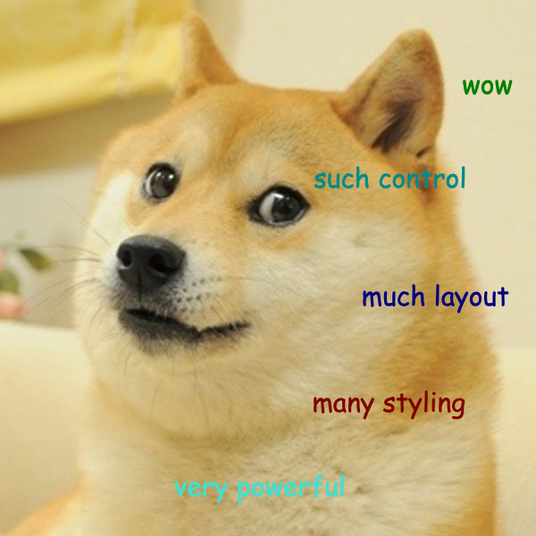

import CodePen from '@handbook/CodePen'

Floating an element changes the behavior of that element and the block level
elements that follow it in normal flow. The element is moved to the left or
right and removed from normal flow, and the surrounding content floats around
the floated item.

## The float property has four possible values:

|           |                                                                                                       |
| --------- | ----------------------------------------------------------------------------------------------------- |
| `left`    | Floats the element to the left.                                                                       |
| `right`   | Floats the element to the right.                                                                      |
| `none`    | Specifies no floating at all. This is the default value.                                              |
| `inherit` | Specifies that the value of the float property should be inherited from the element's parent element. |
|           |                                                                                                       |

<CodePen>

In the example below we float a `
` left, and give it a margin on the right
to push the text away from the element. This gives us the effect of text wrapped
around that box, and is most of what you need to know about floats as used in
modern web design.

> Try removing the `float: left` and see what happens. Or change this to
> `float: right`

<pre data-lang='html'>
{`
<h1>Simple float example</h1>
    

Float

    

 Lorem ipsum dolor sit amet, consectetur adipiscing elit. Nulla luctus aliquam dolor, eu lacinia lorem placerat vulputate. Duis felis orci, pulvinar id metus ut, rutrum luctus orci. Cras porttitor imperdiet nunc, at ultricies tellus laoreet sit amet. Sed auctor cursus massa at porta. Integer ligula ipsum, tristique sit amet orci vel, viverra egestas ligula.

`}
</pre>

<pre data-lang='css'>
{`
.box {
    float: left;
    width: 150px;
    height: 150px;
    margin-right: 30px;
}

/* To give it some style */
.box {
    background-color: rgb(207,232,220);
    border: 2px solid rgb(79,185,227);
    padding: 10px;
    border-radius: 5px;
}
p {
    line-height: 2;
    word-spacing: 0.1rem;
}
`}
</pre>

</CodePen>

---

> WOW, AMAZING, SUCH CONTROL.

Floats are very powerful and for a long time they were the primary means of
controlling the layout of a page. However, now that we have _Flexbox_ and
_Grids_ the use of `float` is returning to it's natural use to allow some
elements to float around others.

You will, on _legacy projects_ still see `float` used for layout.

---
