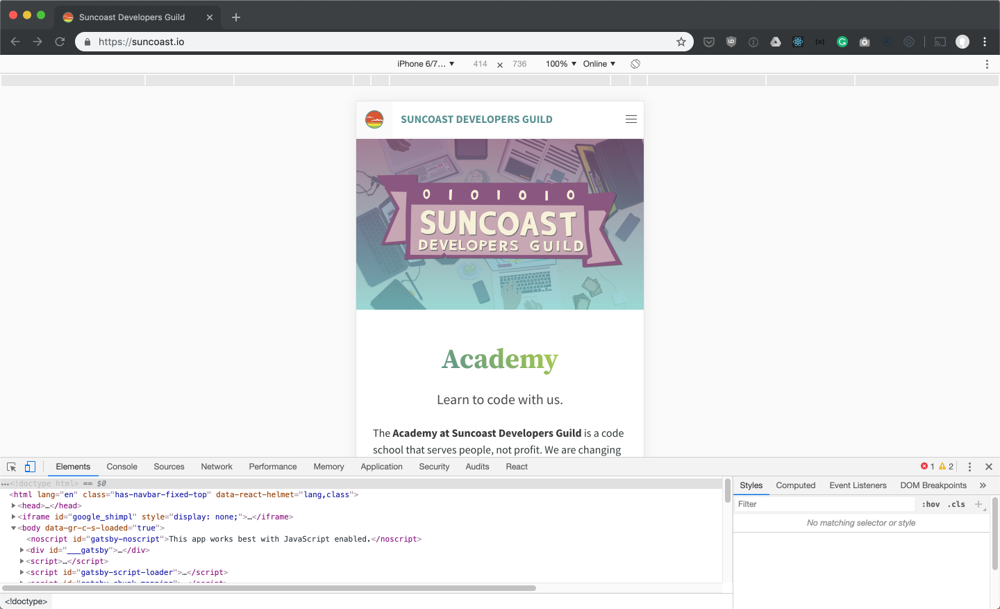

import CodePen from '@handbook/CodePen'

# Workflow

When getting started on a new application it is useful to start with a sketch of the site. Starting this sketch in a narrow mobile size will help you reflect on the core aspects of the site as we mentioned.

## Start with a sketch

Nearly every web site or app should start with a sketch of the user interface. These sketches are typically low resolution/fidelity and serve to show both the developer and the customer what the general look and flow of the application should be.

In their most basic forms these sketches can be pencil drawings, whiteboard diagrams, or vector drawings in a digital tool like Visio, or another design application.

A popular term for this type of sketch is called a [wireframe](https://en.wikipedia.org/wiki/Website_wireframe) and implies that the generated images are meant to be a schematic or a blueprint.

Some popular user interface sketching application even generate drawings in a form that look hand drawn. This is to give the viewer the impression that these are conceptual and are not meant to reflect the actual look and feel of the application.

Also at this stage the content is mostly empty rectangles for images, links, and input. For text we use squiggly lines. If you want to include images or text, use [Lorem Ipsum](https://loremipsum.io/) text and generic grayscale images.

---

## Example

This mockup is made with the popular [Balsamiq](https://balsamiq.com/) tool.

---

## Next Step

Typically we will wireframe as many of the "pages" of our application as we can before generating any HTML or CSS. This helps us determine the various assets we will need, what pages need to be created, and what information we will be collecting from users and what information we will be showing to the user. This will be critical when we start designing APIs and building backend services for the application.

---

## Ready to make HTML and CSS?

When we are reading to make the HTML and CSS for our application we will start coding with our browser in a configuration that is a mobile device size.

There are a few ways to do this. The first is to configure your editor and your browser side-by-side and give the browser a narrow but tall aspect ratio. This will also give your editor maximum space for you to code in.

The second is to use your browser's development tools to set the view into a mobile size. In Chrome we do this by engaging `Developer Tools` and clicking this icon:

Once this view is engaged, we can select several options to change the mobile view of our web page. For instance, the _Suncoast Developers Guild_ website looks like this when in Chrome's mobile view:

> NOTE: This view is purely an estimation of the way the mobile browser will work. Selecting an iPhone or Android device simply scales the browser to that size but does not reproduce any of that device's specific behaviors. Real testing on physical mobile devices is often still required.

---
