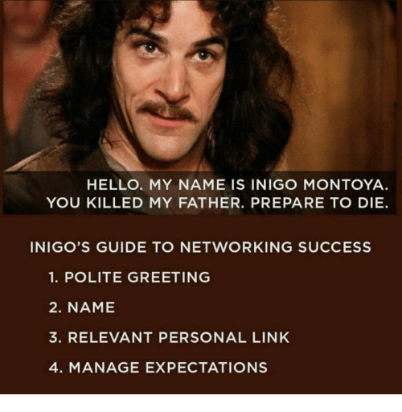

#### Look for the Narrative

- Decode a job listing to find the narrative
    - What problem do they solve?
    - What does their website say about them?
- Make that the context of your cover letter
    - Understand the story
    - Identify with it
    - How you add value?

#### Not There, Find It

- Use the company’s webpage
- Check LinkedIn
- Do they have a blog?
- The more you research a company the better you are prepared to write your cover letter

#### Keys to a good cover letter

##### Don’t Regurgitate Your Resume
- Use your cover letter to describe additional details that you weren’t able to squeeze onto the single page of your resume: “By resolving invoice disputes, I gained a deep analytical knowledge—but more importantly, I learned how to interact calmly and diplomatically with angry customers.” 
- A cover letter gives you the freedom to use full sentences—instead of bullet points—so use them to expand upon your resume points and tell the story of why you’re the perfect fit for the company

##### Clearly Show What You’re Capable Of
- Beyond explaining what you’ve done in the past, show hiring managers what you can do in the future. 
- Describe your skills and how they can be used for the position

##### Not Necessarily Your Education
- At the end of the day, what hiring managers care about most is your work experience (and yes, that can be volunteer or internship experience, too)and what you can walk through the door and deliver on Day 1.

##### Don’t Apologize for Skills You Don’t Have
- Instead of drawing attention to your weaknesses, turn it around to focus on the skills you do have and how they are a benefit

##### Highlight the Right Experiences
- Not sure what skills and experiences you should be featuring? 
- Look through the job description for keywords you can highlight from your experience.

##### Tell a Story
- What brings you to this company?
- Highlight what you found in their Narrative

##### Think Custom, Not Canned
- Most companies want to see that you’re truly excited about the position and company, which means creating a custom letter for each position you apply for.

##### Write in the Company’s “Voice”
- Cover letters are a great way to show that you understand the environment and culture of the company and industry and prove that you’ve got what they are looking for.
- We’ve mentioned this before, know their Narrative

##### Don’t Let Your Fear of Bragging Get in the Way
- Imagine you’re someone else writing a letter about yourself. Think from the perspective of a friend, mentor, or previous employer—someone who would only sing your praises—and then write the letter from her point of view

##### Have Someone Gut Check It
- Have a friend take a look at your cover letter, and ask him or her two questions: 
    - Does this sell me as the best person for the job?
    - Does it get you excited? 
- If the answer to either is “no,” or even slight hesitation, go back for another pass.

##### Proofread and ask two people to review it
- Having extra eyes on it will help catch any errors or typos you may have missed (Hint: [Grammarly](https://www.grammarly.com/) should be your best friend)

#### Resources

- [Mock Job Descriptions](https://docs.google.com/document/d/e/2PACX-1vTAUdgkKCLK7MgA-rbHOwNxWmUipr6_aSw2_uxL2Rn_f9zetpPoGbY-tEtceWqdM2h5GvqJnZUzF2N-/pub)

- [Access the slide presentation](./assets/cover-letters.pdf)
- [How to write a cover letter](https://www.skillgigs.com/blog/how-to-write-a-cover-letter/)
