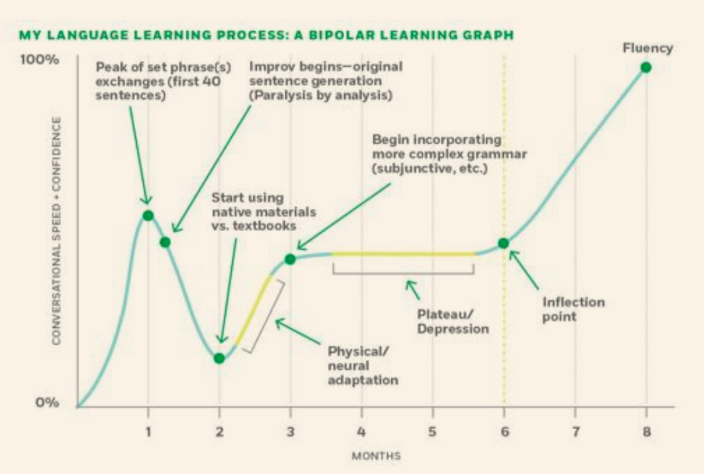

# Introduction

## What is Pre-work?

Pre-work is a series of articles, videos, blogs and other useful information designed to set you up for success at Suncoast Developers Guild. In addition to setting context, this will help start your journey on the right path and help frame what and how you will be learning.

## Why does Pre-work Help?

Starting learning before the program is like training for a marathon. You don't show up the day of the race and start; you need to train beforehand. In our program, your brain is the muscle that needs to prepare. This pre-work is training for your mind.

Ideally, when the program begins, you'll hear concepts for a second time. The plan is, the 2nd time you learn it, it sticks. And by the third time you learn it, you're able to teach it. That means you should be reviewing, learning and playing with the material before day 1.

## What won't the Pre-work do for you

Pre-work only covers the basics; What we teach goes much more in-depth than tutorials can cover. Pre-work is not designed to try to explain everything about web development. We use it to establish context and a shared language to jump-start the learning process.

Pre-work, and also the curriculum, is not the single source of truth to get started. The information for all of our technologies is out there, available to all. We love this, embrace it, and encourage you to learn both inside and outside the class.

## This Curriculum

We aim to create "T" based developers -- people with both breadth of knowledge, as well as a depth of knowledge in a particular area.
This curriculum is organized at a high-level by the Bipolar Learning Graph:

There are roughly eight-time units on the graph. So if your timeline is 12 weeks, each milestone is approximately 1.5 weeks. So the process of learning to code might look like:

- sugar high @ week 1.5
- immediate drop and low point @ week 3
- rapid progress after low point, followed by a plateau @ week 4.5
- inflection point @ week 9.5
- fluency @ week 12

Don't forget that the cadence at a micro-level – not just the macro – is also essential. The serial position effect (embedded below) demonstrates that we inherently learn and retain the first few and last few items discussed. By using, perhaps, a [Pomodoro Technique™](https://lifehacker.com/productivity-101-a-primer-to-the-pomodoro-technique-1598992730) with short breaks in-between, we can encourage a higher retention rate of materials by splitting lecture up into ~45-minute segments with ~10-15 minutes of break in-between.

Following these paradigms, we will work through lots of exercises and challenges throughout most lectures, and follow an objective-based path that keeps us focused and productive.

[Next](/handbook/prework/02-housekeeping)
