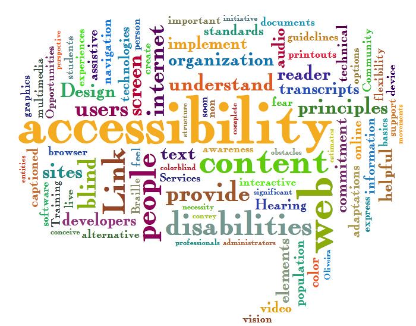

# Web Accessibility

## Why is it important?
- People with disabilities should able to easily access the web content.
- Implementing web accessibility will give equal opportunity and chance to people with disabilities or older people (who are facing changing abilities due to aging).
- In United states there is law “Americans with Disabilities Act – 1990” which addresses the needs of people with disabilities.

## What is it?

### Accessibility for people with:
- Poor vision or Blindness
- Reading problems
- Physically disable people who failed to operate keyboard or mouse efficiently.
- Hearing problems

### 5 categories of disability:
- Visual
- Hearing
- Cognitive
- Motor 
- Seizure 

## 1 in 5 Americans have or experience disabilities
- Disabilities can be permanent or temporary
- Color blindness, partial blindness, hearing impairment or sensitivity, carpal tunnel syndrome, broken arms, autism, dyslexia, ADHD, and more..
- Many things you might not think of could impair someone’s ability to utilize your website.
- As people age, the way they interact with websites changes as well.

## Would this be Accessible?

## Web Content Accessibility Guidelines

### The principles of WCAG 2.0 are:

#### Perceivable
- About the senses people use when browsing the web.
    - Provide text alternatives for any non-text content so that it can be changed into other forms people need, such as large print, braille, speech, symbols, or simpler language.
    - Make sure all your  important images have an alt tags. More than “Photo of _____”
    - If the image is decorative, or unnecessary for understanding the content leave alt blank.
    - Make sure images are named something vaguely descriptive.
    - Orientation on mobile devices falls under this principle.

#### Operable
- About the actions people take when browsing
    - More than one way is available to locate a web page within a set of web pages except where the web page is a the result of, or a step in a process
    - Information about the user’s location with a set of web pages is available
    - Sitemaps
    - Breadcrumbs
    - Section Titles and headings
    - Keyboards for mobile devices fall under this principle

#### Understandable
- Must use clear terms, have simple instructions and explain complex issues
    - If an input error is automatically detected and suggestions for correction are known, then the suggestions are provided to the user, unless it would jeopardize the security or purpose of the content.
    - An example would be password errors
    - Provide prompts if possible in plain text.

#### Robust
- Third-party technology (like web browsers and screen readers) can rely on
    - Write clean code.
    - Use appropriate html tags--not everything should be a div!
    - Use name, role, and value in forms.
    - Don’t forget your doctype!
    - Perform accessibility audits.

## WCAG 2.0 Levels

- Level A – the most basic web accessibility features
- Level AA – deals with the biggest and most common barriers for disabled users
- Level AAA – the highest (and most complex) level of web accessibility

## Tools

[Web Content Accessibility Guidelines (WCAG) 2.1](https://www.w3.org/TR/WCAG21/)

[Check list](https://a11yproject.com/checklist.html )

[Color Filter](https://www.toptal.com/designers/colorfilter)

[COLOR SAFE](http://colorsafe.co/)

[Accessible color palette builder](https://toolness.github.io/accessible-color-matrix/)

Chrome extensions:
- WAVE Tool 
- aXe - provides accessibility tab in dev tools
- Accessibility Developer Tools - performs audit in dev tools
- WCAG Accessibility Audit 
- WCAG Luminosity Contrast Ratio Analyzer

## Resources

[https://a11yproject.com/](https://a11yproject.com/)

[https://webaim.org/](https://webaim.org/)

[https://www.w3.org/WAI/intro/accessibility.php](https://www.w3.org/WAI/intro/accessibility.php)

[https://www.adagetechnologies.com/4-compelling-reasons-get-website-ada-wcag-accessible/](https://www.adagetechnologies.com/4-compelling-reasons-get-website-ada-wcag-accessible/)

[https://18f.gsa.gov/](https://18f.gsa.gov/) - example of a well designed and accessible website

[https://myblindspot.org/](https://myblindspot.org/) - organization for accessibility and well designed

[https://www.w3.org/WAI/bcase/Overview](https://www.w3.org/WAI/bcase/Overview)  - Business case for accessibility

